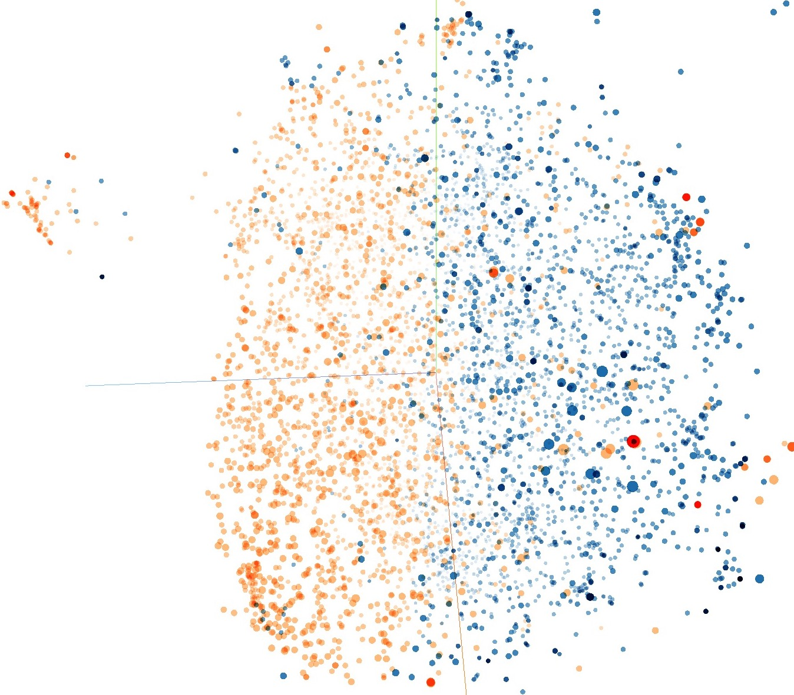
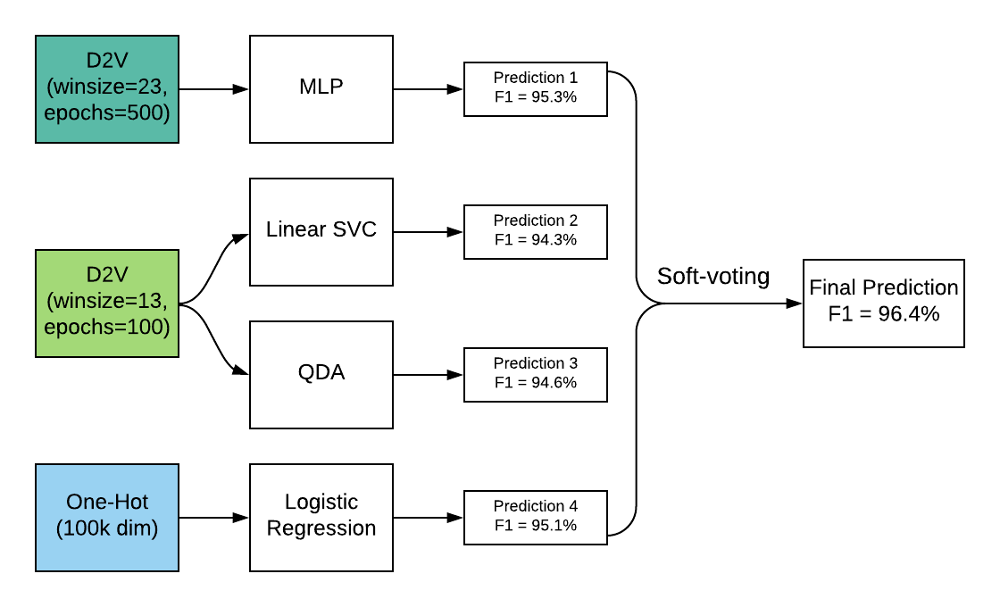

# Table of Contents
- [Fake News Detection Pipeline](#fake-news-detection-pipeline)
  * [Collaborators Shuheng Liu, Qiaoyi Yin, Yuyuan  Fang ](#collaborators-shuheng-liu-qiaoyi-yin-yuyuan-fang)
  * [Project Plan](#project-plan)
- [Notice for Collaborators](#notice-for-collaborators)
  * [Doing Train-Test Split](#doing-train-test-split)
  * [Directory to Push Models](#directory-to-push-models)
- [Downloadables](#downloadables)
  * [URL for Different Embeddings Precomputed on Cloud](#url-for-different-embeddings-precomputed-on-cloud)
  * [Hypyertuning Logs, Codes, and Stats](#hypyertuning-logs-codes-and-stats)
- [Quick Walkthrough (Presentation)](#quick-walkthrough-presentation)
  * [Infrastructure for Embeddings](#infrastructure-for-embeddings)
  * [Embedding Computation](#embedding-computation)
    + [URLs](#urls)
  * [Embedding Visualization](#embedding-visualization)
    + [2D T-SNE](#2d-t-sne)
    + [3D T-SNE](#3d-t-sne)
    + [Visualizing Bigram Statistics](#visualizing-bigram-statistics)
  * [Binary Classification](#binary-classification)
    + [Train-Val-Test Split](#train-val-test-split)
    + [Hypertuned Classifiers](#hypertuned-classifiers)
    + [Histogram of CV/Test Scores](#histogram-of-cvtest-scores)
    + [TF-IDF](#tf-idf)
    + [Feature Ranking with Logistic Coefficients](#feature-ranking-with-logistic-coefficients)
    + [Ensemble Learning](#ensemble-learning)


# Fake News Detection Pipeline
## Collaborators Shuheng Liu, Qiaoyi Yin, Yuyuan Fang

Group project materials for fake news detection at Hollis Lab, GEC Academy

## Project Plan


# Notice for Collaborators
## Doing Train-Test Split
Specifying `random_state` in `sklearn.model_selection.train_test_split()` ensures same split on different datasets 
(of the same length), and on different machines. 
(See this [link](https://stackoverflow.com/questions/43095076/scikit-learn-train-test-split-can-i-ensure-same-splits-on-different-datasets)) 

For purpose of this project, we will be using `random_state=58` for each split.

While grid/random searching for the best set of hyperparameters, a 75%-25% train-test-split is used. A 5-Fold 
cross-validation is used in the training phase on the 75% samples.

## Directory to Push Models
There is a `model/` directory nested under the project. Please name your model as `model_name.py`, and place it under 
the `model/` directory (e.g. `model/KNN.py`) before pushing to this repo. 

# Downloadables
Before trying to reproduce our result, please know that pre-computed embeddings can be downloaded from the URLs below. Consider downloading them and storing them into the `pretrained/` folder under this repository, which will save a lot of time.
## URL for Different Embeddings Precomputed on Cloud
- [all computed embeddings and labels](https://www.floydhub.com/wish1104/datasets/fake-news-embeddings/5), see list below
- [onehot title & text (sparse matrix)](https://www.floydhub.com/wish1104/projects/fake-news/33/output), scorer: 
raw-count
- [onehot title & text (sparse matrix)](https://www.floydhub.com/wish1104/projects/fake-news/35/output), scorer: 
raw-count, L2-normalized
- [onehot title & text (sparse matrix)](https://www.floydhub.com/wish1104/projects/fake-news/38/output), scorer: 
tfidf
- [onehot title & text (sparse matrix)](https://www.floydhub.com/wish1104/projects/fake-news/41/output), scorer: 
tfidf, L2-normalized
- [naive doc2vec title](https://www.floydhub.com/wish1104/projects/fake-news/19/output), normalizer: {L2, mean, None}
- [naive doc2vec text](https://www.floydhub.com/wish1104/projects/fake-news/20/output), normalizer: {L2, mean, None}
- [doc2vec title](https://www.floydhub.com/wish1104/projects/fake-news/21/output), window_size: 13, 
min_count:{5, 25, 50}, strategy: {DM, DBOW}, epochs: 100; all six combinations tried
- [doc2vec text](https://www.floydhub.com/wish1104/projects/fake-news/22/output), window_size: 13, 
min_count:{5, 25, 50}, strategy: {DM, DBOW}, epochs: 100; all six combinations tried
- [doc2vec title](https://www.floydhub.com/wish1104/projects/fake-news/88/output), window_size: {13, 23}, min_count: 5, 
strategy: DBOW, epochs: {200, 500}; all four combinations tried
- [doc2vec text](https://www.floydhub.com/wish1104/projects/fake-news/88/output), window_size: {13. 23}, min_count: 5, 
strategy: DBOW, epochs: {200, 500}; all four combinations tried

## Hypyertuning Logs, Codes, and Stats
The logs, codes, and stats of hypertuning all simple models (that is, excluding Ensemble model) can be found [here](https://www.floydhub.com/wish1104/projects/fake-news/jobs).


# Quick Walkthrough (Presentation)
*Below is the final presentation, originally implemented in jupyter notebook. To see the original presentation file, checkout the following command in your terminal*

```bash
git log --  "UCB Final Project.ipynb"
```
*or,*
```bash
git checkout f7e1c41
```
*Alternatively, visit [this link which takes you back in history](https://github.com/Johnny-Wish/fake-news-detection-pipeline/blob/f7e1c41c675d8c43a2d0039bcdf2558cdf6748ec/UCB%20Final%20Project.ipynb).*

## Infrastructure for Embeddings

The following classes `DocumentSequence` and `DocumentEmbedder` can be found in tools.py. We encapsulated different ways of computing embeddings (doc2vec, naive doc2vec, one-hot) and their choices of hyperparameters in these files. Below is a snapshot of these classes their methods.
```python
class DocumentSequence:
    def __init__(self, raw_docs, clean=False, sw=None, punct=None): ...
    # setters (only to be called internally)
    def _set_tokenized(self, clean=False, sw=None, punct=None): ...
    def _set_tagged(self): ...
    def _set_dictionary(self): ...
    def _set_bow(self): ...
    # getters (exposed)
    def get_dictionary(self): ...  # property field `dictionary` available
    def get_tokenized(self): ...  # property field `tokenized` available
    def get_tagged(self): ...  # property field `tagged` available
    def get_bow(self): ...  # property field `bow` available
```

```python

class DocumentEmbedder:
    def __init__(self, docs: DocumentSequence, pretrained_word2vec=None): ...
    # setters (only to be called internally)    
    def _set_word2vec(self): ...
    def _set_doc2vec(self, vector_size=300, window=5, min_count=5, dm=1, epochs=20): ...
    def _set_naive_doc2vec(self, normalizer='l2'): ...
    def _set_tfidf(self): ...
    def _set_onehot(self, scorer='tfidf'): ...
    # getters (exposed)
    def get_onehot(self, scorer='tfidf'): ...  # property `onehot` available
    def get_doc2vec(self, vectors_size=300, window=5, min_count=5, dm=1, epochs=20): ...  
        											# property doc2vec available
    def get_naive_doc2vec(self, normalizer='l2'): ...  # property `naive_doc2vec` available
    def get_tfidf_score(self): ...  # property `tfidf` available
```


```python
import pandas as pd
from string import punctuation
from nltk.corpus import stopwords

df = pd.read_csv("./fake_or_real_news.csv")

# obtain the raw news texts and titles
raw_text = df['text'].values
raw_title = df['title'].values
df['label'] = df['label'].apply(lambda label: 1 if label == "FAKE" else 0)

# build two instances for preprocessing raw data
from tools import DocumentSequence
texts = DocumentSequence(raw_text, clean=True, sw=stopwords.words('english'), punct=punctuation)
titles = DocumentSequence(raw_title, clean=True, sw=stopwords.words('english'), punct=punctuation)

df.head()
```

<table border="1" class="dataframe">
  <thead>
    <tr style="text-align: right;">
      <th></th>
      <th>Unnamed: 0</th>
      <th>title</th>
      <th>text</th>
      <th>label</th>
      <th>title_vectors</th>
    </tr>
  </thead>
  <tbody>
    <tr>
      <th>0</th>
      <td>8476</td>
      <td>You Can Smell Hillary’s Fear</td>
      <td>Daniel Greenfield, a Shillman Journalism Fello...</td>
      <td>1</td>
      <td>[ 1.1533764e-02  4.2144405e-03  1.9692603e-02 ...</td>
    </tr>
    <tr>
      <th>1</th>
      <td>10294</td>
      <td>Watch The Exact Moment Paul Ryan Committed Pol...</td>
      <td>Google Pinterest Digg Linkedin Reddit Stumbleu...</td>
      <td>1</td>
      <td>[ 0.11267698  0.02518966 -0.00212591  0.021095...</td>
    </tr>
    <tr>
      <th>2</th>
      <td>3608</td>
      <td>Kerry to go to Paris in gesture of sympathy</td>
      <td>U.S. Secretary of State John F. Kerry said Mon...</td>
      <td>0</td>
      <td>[ 0.04253004  0.04300297  0.01848392  0.048672...</td>
    </tr>
    <tr>
      <th>3</th>
      <td>10142</td>
      <td>Bernie supporters on Twitter erupt in anger ag...</td>
      <td>— Kaydee King (@KaydeeKing) November 9, 2016 T...</td>
      <td>1</td>
      <td>[ 0.10801624  0.11583211  0.02874823  0.061732...</td>
    </tr>
    <tr>
      <th>4</th>
      <td>875</td>
      <td>The Battle of New York: Why This Primary Matters</td>
      <td>It's primary day in New York and front-runners...</td>
      <td>0</td>
      <td>[ 1.69016439e-02  7.13498285e-03 -7.81233795e-...</td>
    </tr>
  </tbody>
</table>


## Embedding Computation
### URLs
- [all computed embeddings and labels](https://www.floydhub.com/wish1104/datasets/fake-news-embeddings/5), see list below
- [onehot title & text (sparse matrix)](https://www.floydhub.com/wish1104/projects/fake-news/33/output), scorer: 
raw-count
- [onehot title & text (sparse matrix)](https://www.floydhub.com/wish1104/projects/fake-news/35/output), scorer: 
raw-count, L2-normalized
- [onehot title & text (sparse matrix)](https://www.floydhub.com/wish1104/projects/fake-news/38/output), scorer: 
tfidf
- [onehot title & text (sparse matrix)](https://www.floydhub.com/wish1104/projects/fake-news/41/output), scorer: 
tfidf, L2-normalized
- [naive doc2vec title](https://www.floydhub.com/wish1104/projects/fake-news/19/output), normalizer: {L2, mean, None}
- [naive doc2vec text](https://www.floydhub.com/wish1104/projects/fake-news/20/output), normalizer: {L2, mean, None}
- [doc2vec title](https://www.floydhub.com/wish1104/projects/fake-news/21/output), window_size: 13, 
min_count:{5, 25, 50}, strategy: {DM, DBOW}, epochs: 100; all six combinations tried
- [doc2vec text](https://www.floydhub.com/wish1104/projects/fake-news/22/output), window_size: 13, 
min_count:{5, 25, 50}, strategy: {DM, DBOW}, epochs: 100; all six combinations tried
- [doc2vec title](https://www.floydhub.com/wish1104/projects/fake-news/88/output), window_size: {13, 23}, min_count: 5, 
strategy: DBOW, epochs: {200, 500}; all four combinations tried
- [doc2vec text](https://www.floydhub.com/wish1104/projects/fake-news/88/output), window_size: {13. 23}, min_count: 5, 
strategy: DBOW, epochs: {200, 500}; all four combinations tried


```python
from tools import DocumentEmbedder

try:
    from embedding_loader import EmbeddingLoader

    loader = EmbeddingLoader("pretrained/")
    news_embeddings = loader.get_d2v("concat", vec_size=300, win_size=23, min_count=5, dm=0, epochs=500)
    labels = loader.get_label()

except FileNotFoundError as e:
    print(e)
    print("Cannot find existing embeddings, computing new ones now")

    pretrained = "./pretrained/GoogleNews-vectors-negative300.bin"
    text_embedder = DocumentEmbedder(texts, pretrained_word2vec=pretrained)
    title_embedder = DocumentEmbedder(titles, pretrained_word2vec=pretrained)

    text_embeddings = text_embedder.get_doc2vec(vectors_size=300, window=23, min_count=5, dm=0, epochs=500)
    title_embeddings = title_embedder.get_doc2vec(vectors_size=300, window=23, min_count=5, dm=0, epochs=500)
    
    # concatenate title vectors and text vectors
    news_embeddings = np.concatenate((title_embeddings, text_embeddings), axis=1)
    labels = df['label'].values

```

## Embedding Visualization


```python
from embedding_visualizer import visualize_embeddings

# visualize the news embeddings in the graph
# MUST run in command line "tensorboard --logdir visual/" and visit localhost:6006 to see the visualization
visualize_embeddings(embedding_values=news_embeddings, label_values=labels, texts = raw_title)
```


```python
print("visit https://localhost:6006 to see the result")
# ATTENTION: This cell must be manually stopped
```

    visit https://localhost:6006 to see the result


Some screenshots of the tensorboard are shown below. We visuallize the embeddings of documents with T-SNE projection on 3D and 2D spaces. Each red data point indicates a piece of FAKE news, and each blue one indicates a piece of real news. These two categories are well-separated as can be seen from the visualization.

### 2D T-SNE

red for fake ones, blue for real ones


### 3D T-SNE

red for fake ones, blue for real ones



### Visualizing Bigram Statistics


```python
import itertools
import nltk
import numpy as np
import matplotlib.pyplot as plt
from collections import Counter

## Get tokenized words of fake news and real news independently
real_text = df[df['label'] == 0]['text'].values
fake_text = df[df['label'] == 1]['text'].values
sw = [word for word in stopwords.words("english")] + ["``", "“"]
other_puncts = u'.,;《》？！“”‘’@#￥%…&×（）——+【】{};；●，。&～、|\s:：````'
punct = punctuation + other_puncts
fake_words = DocumentSequence(real_text, clean=True, sw=sw, punct=punct)
real_words = DocumentSequence(fake_text, clean=True, sw=sw, punct=punct)

## Get cleaned text using chain
real_words_all = list(itertools.chain(*real_words.get_tokenized()))
fake_words_all = list(itertools.chain(*fake_words.get_tokenized()))

## Drawing histogram
def plot_most_common_words(num_to_show,words_list,title = ""):
    bigrams = nltk.bigrams(words_list)
    counter = Counter(bigrams)
    labels = [" ".join(e[0]) for e in counter.most_common(num_to_show)]
    values = [e[1] for e in counter.most_common(num_to_show)]

    indexes = np.arange(len(labels))
    width = 1
    
    plt.title(title)
    plt.barh(indexes, values, width)
    plt.yticks(indexes + width * 0.2, labels)
    plt.show()
```


```python
plot_most_common_words(20, fake_words_all, "Fake News Most Frequent words")
plot_most_common_words(20, real_words_all, "Real News Most Frequent words")
```


## Binary Classification

### Train-Val-Test Split

(with 75% of data for 5-fold Random CV, 25% for testing)


```python
from sklearn.model_selection import RandomizedSearchCV, train_test_split
from sklearn.model_selection._search import BaseSearchCV
import pickle as pkl

seed = 58

# perform the split which gets us the train data and the test data
news_train, news_test, labels_train, labels_test = train_test_split(news_embeddings, labels,
                                                                    test_size=0.25,
                                                                    random_state=seed,
                                                                    stratify=labels)
```

### Hypertuned Classifiers

We used RandomSearch on different datasets to get the best hyper-parameters.    
The following exhibits every classifier with almost optimal parameters in our experiments.   
The RandomSearch process is omitted.


```python
from model.hypyertuned_models import mlp, knn, qda, gdb, svc, gnb, rf, lg
from model.hypyertuned_models import classifiers as classifiers_list
```

We list the best-performing hyperparameters in the following chart.


```python
from sklearn.metrics import classification_report

# print details of testing results
for model in classifiers_list:
    model.fit(news_train, labels_train)
    labels_pred = model.predict(news_test)
    
    # Report the metrics
    target_names = ['Real', 'Fake']
    print(model.__class__.__name__)
    print(classification_report(y_true=labels_test, y_pred=labels_pred, target_names=target_names, digits=3))
```

    MLPClassifier
                 precision    recall  f1-score   support
    
           Real      0.956     0.950     0.953       793
           Fake      0.950     0.956     0.953       791
    
    avg / total      0.953     0.953     0.953      1584
    
    KNeighborsClassifier
                 precision    recall  f1-score   support
    
           Real      0.849     0.905     0.876       793
           Fake      0.898     0.838     0.867       791
    
    avg / total      0.874     0.872     0.872      1584
    
    QuadraticDiscriminantAnalysis
                 precision    recall  f1-score   support
    
           Real      0.784     0.995     0.877       793
           Fake      0.993     0.726     0.839       791
    
    avg / total      0.889     0.860     0.858      1584
    
    GradientBoostingClassifier
                 precision    recall  f1-score   support
    
           Real      0.921     0.868     0.894       793
           Fake      0.875     0.925     0.899       791
    
    avg / total      0.898     0.896     0.896      1584
    
    SVC
                 precision    recall  f1-score   support
    
           Real      0.944     0.939     0.942       793
           Fake      0.940     0.944     0.942       791
    
    avg / total      0.942     0.942     0.942      1584
    
    GaussianNB
                 precision    recall  f1-score   support
    
           Real      0.848     0.793     0.820       793
           Fake      0.805     0.857     0.830       791
    
    avg / total      0.826     0.825     0.825      1584
    
    RandomForestClassifier
                 precision    recall  f1-score   support
    
           Real      0.868     0.805     0.835       793
           Fake      0.817     0.877     0.846       791
    
    avg / total      0.843     0.841     0.841      1584
    
    LogisticRegression
                 precision    recall  f1-score   support
    
           Real      0.921     0.929     0.925       793
           Fake      0.929     0.920     0.924       791
    
    avg / total      0.925     0.925     0.925      1584


### Histogram of CV/Test Scores


### TF-IDF
Getting sparse matrix


```python
def bow2sparse(tfidf, corpus):
    rows = [index for index, line in enumerate(corpus) for _ in tfidf[line]]
    cols = [elem[0] for line in corpus for elem in tfidf[line]]
    data = [elem[1] for line in corpus for elem in tfidf[line]]
    return csr_matrix((data, (rows, cols)))
```


```python
from gensim import corpora, models
from scipy.sparse import csr_matrix 

tfidf = models.TfidfModel(texts.get_bow())
tfidf_matrix = bow2sparse(tfidf, texts.get_bow())

## split the data
news_train, news_test, labels_train, labels_test = train_test_split(tfidf_matrix, 
                                                                    labels,
                                                                    test_size=0.25,
                                                                    random_state=seed)
```

    dictionary is not set for <tools.DocumentSequence object at 0x11766bac8>, setting dictionary automatically


```python
from sklearn.linear_model import LogisticRegression
from sklearn.naive_bayes import MultinomialNB

# LogisticRegression
lg = LogisticRegression(C=104.31438384172546, penalty = 'l2')

# Naive Bayes
nb = MultinomialNB(alpha = 0.01977091215797838)

classifiers_list = [lg, nb]

from sklearn.metrics import classification_report

# print details of testing results
for model in classifiers_list:
    model.fit(news_train, labels_train)
    labels_pred = model.predict(news_test)
    
    # Report the metrics
    target_names = ['Real', 'Fake']
    print(str(model))
    print(classification_report(y_true=labels_test, y_pred=labels_pred, target_names=target_names, digits=3))
```

    LogisticRegression(C=104.31438384172546, class_weight=None, dual=False,
              fit_intercept=True, intercept_scaling=1, max_iter=100,
              multi_class='ovr', n_jobs=1, penalty='l2', random_state=None,
              solver='liblinear', tol=0.0001, verbose=0, warm_start=False)
                 precision    recall  f1-score   support
    
           Real      0.964     0.913     0.938       820
           Fake      0.912     0.963     0.937       764
    
    avg / total      0.939     0.938     0.938      1584
    
    MultinomialNB(alpha=0.01977091215797838, class_prior=None, fit_prior=True)
                 precision    recall  f1-score   support
    
           Real      0.899     0.930     0.914       820
           Fake      0.922     0.887     0.905       764
    
    avg / total      0.910     0.910     0.910      1584


### Feature Ranking with Logistic Coefficients


```python
# LogisticRegression
lg = LogisticRegression(C=104.31438384172546, penalty = 'l2')

# Using whole data set
lg.fit(tfidf_matrix, labels)

# map the coeffients with word and sort the coeffients
abs_features = []
num_features = tfidf_matrix.shape[0]
for i in range(num_features):
    coef = lg.coef_[0,i]
    abs_features.append(((coef), texts.get_dictionary()[i]))
        
sorted_result = sorted(abs_features, reverse = True)
fake_importance = [x for x in sorted_result if x[0] > 3]
real_importance = [x for x in sorted_result if x[0] < -4]
```


```python
from wordcloud import WordCloud, STOPWORDS

def print_wordcloud(df, title=''):
    wordcloud = WordCloud(stopwords=STOPWORDS, background_color='white', width=1200, height=1000).generate(
        " ".join(df['word'].values))
    plt.imshow(wordcloud)
    plt.title(title)
    plt.axis('off')
    plt.show()
```

Words  with inclination to predict 'FAKE' news


```python
df2 = pd.DataFrame(fake_importance, columns=['importance', 'word'])
df2.head(30)
```


<div>
<table border="1" class="dataframe">
  <thead>
    <tr style="text-align: center;">
      <th></th>
      <th>importance</th>
      <th>word</th>
    </tr>
  </thead>
  <tbody>
    <tr>
      <th>0</th>
      <td>13.781102</td>
      <td>0</td>
    </tr>
    <tr>
      <th>1</th>
      <td>13.562957</td>
      <td>2016</td>
    </tr>
    <tr>
      <th>2</th>
      <td>13.490582</td>
      <td>october</td>
    </tr>
    <tr>
      <th>3</th>
      <td>13.062496</td>
      <td>hillary</td>
    </tr>
    <tr>
      <th>4</th>
      <td>11.192181</td>
      <td>‘</td>
    </tr>
    <tr>
      <th>5</th>
      <td>9.829864</td>
      <td>article</td>
    </tr>
    <tr>
      <th>6</th>
      <td>9.411360</td>
      <td>election</td>
    </tr>
    <tr>
      <th>7</th>
      <td>8.903777</td>
      <td>november</td>
    </tr>
    <tr>
      <th>8</th>
      <td>8.181044</td>
      <td>share</td>
    </tr>
    <tr>
      <th>9</th>
      <td>7.564924</td>
      <td>print</td>
    </tr>
    <tr>
      <th>10</th>
      <td>7.507189</td>
      <td>source</td>
    </tr>
    <tr>
      <th>11</th>
      <td>7.418819</td>
      <td>via</td>
    </tr>
    <tr>
      <th>12</th>
      <td>7.150410</td>
      <td>fbi</td>
    </tr>
    <tr>
      <th>13</th>
      <td>6.939386</td>
      <td>establishment</td>
    </tr>
    <tr>
      <th>14</th>
      <td>6.752492</td>
      <td>us</td>
    </tr>
    <tr>
      <th>15</th>
      <td>6.549759</td>
      <td>please</td>
    </tr>
    <tr>
      <th>16</th>
      <td>6.421927</td>
      <td>28</td>
    </tr>
    <tr>
      <th>17</th>
      <td>6.111584</td>
      <td>wikileaks</td>
    </tr>
    <tr>
      <th>18</th>
      <td>5.914297</td>
      <td>russia</td>
    </tr>
    <tr>
      <th>19</th>
      <td>5.777677</td>
      <td>4</td>
    </tr>
    <tr>
      <th>20</th>
      <td>5.701762</td>
      <td>›</td>
    </tr>
    <tr>
      <th>21</th>
      <td>5.701082</td>
      <td>email</td>
    </tr>
    <tr>
      <th>22</th>
      <td>5.633363</td>
      <td>war</td>
    </tr>
    <tr>
      <th>23</th>
      <td>5.461951</td>
      <td>corporate</td>
    </tr>
    <tr>
      <th>24</th>
      <td>5.432547</td>
      <td>26</td>
    </tr>
    <tr>
      <th>25</th>
      <td>5.248264</td>
      <td>photo</td>
    </tr>
    <tr>
      <th>26</th>
      <td>5.205658</td>
      <td>1</td>
    </tr>
    <tr>
      <th>27</th>
      <td>5.178585</td>
      <td>healthcare</td>
    </tr>
    <tr>
      <th>28</th>
      <td>5.066447</td>
      <td>google</td>
    </tr>
    <tr>
      <th>29</th>
      <td>5.055815</td>
      <td>free</td>
    </tr>
  </tbody>
</table>


```python
print_wordcloud(df2,'FAKE NEWS')
```


Words with inclination to predict 'REAL' news


```python
df3 = pd.DataFrame(real_importance, columns=['importance', 'word'])
df3.tail(30)
```


<div>
<table border="1" class="dataframe">
  <thead>
    <tr style="text-align: center;">
      <th></th>
      <th>importance</th>
      <th>word</th>
    </tr>
  </thead>
  <tbody>
    <tr>
      <th>48</th>
      <td>-5.819761</td>
      <td>march</td>
    </tr>
    <tr>
      <th>49</th>
      <td>-5.820939</td>
      <td>state</td>
    </tr>
    <tr>
      <th>50</th>
      <td>-5.911077</td>
      <td>attacks</td>
    </tr>
    <tr>
      <th>51</th>
      <td>-5.911102</td>
      <td>deal</td>
    </tr>
    <tr>
      <th>52</th>
      <td>-5.918800</td>
      <td>monday</td>
    </tr>
    <tr>
      <th>53</th>
      <td>-5.937717</td>
      <td>saturday</td>
    </tr>
    <tr>
      <th>54</th>
      <td>-6.068661</td>
      <td>president</td>
    </tr>
    <tr>
      <th>55</th>
      <td>-6.108548</td>
      <td>conservatives</td>
    </tr>
    <tr>
      <th>56</th>
      <td>-6.197634</td>
      <td>sanders</td>
    </tr>
    <tr>
      <th>57</th>
      <td>-6.316225</td>
      <td>continue</td>
    </tr>
    <tr>
      <th>58</th>
      <td>-6.577535</td>
      <td>``</td>
    </tr>
    <tr>
      <th>59</th>
      <td>-6.595120</td>
      <td>polarization</td>
    </tr>
    <tr>
      <th>60</th>
      <td>-6.629481</td>
      <td>fox</td>
    </tr>
    <tr>
      <th>61</th>
      <td>-6.644741</td>
      <td>gop</td>
    </tr>
    <tr>
      <th>62</th>
      <td>-6.681231</td>
      <td>ohio</td>
    </tr>
    <tr>
      <th>63</th>
      <td>-6.899471</td>
      <td>convention</td>
    </tr>
    <tr>
      <th>64</th>
      <td>-7.051062</td>
      <td>jobs</td>
    </tr>
    <tr>
      <th>65</th>
      <td>-7.260832</td>
      <td>debate</td>
    </tr>
    <tr>
      <th>66</th>
      <td>-7.274652</td>
      <td>friday</td>
    </tr>
    <tr>
      <th>67</th>
      <td>-7.580725</td>
      <td>tuesday</td>
    </tr>
    <tr>
      <th>68</th>
      <td>-7.847131</td>
      <td>cruz</td>
    </tr>
    <tr>
      <th>69</th>
      <td>-8.058610</td>
      <td>candidates</td>
    </tr>
    <tr>
      <th>70</th>
      <td>-8.348688</td>
      <td>conservative</td>
    </tr>
    <tr>
      <th>71</th>
      <td>-8.440797</td>
      <td>says</td>
    </tr>
    <tr>
      <th>72</th>
      <td>-8.828907</td>
      <td>islamic</td>
    </tr>
    <tr>
      <th>73</th>
      <td>-10.438137</td>
      <td>—</td>
    </tr>
    <tr>
      <th>74</th>
      <td>-10.851531</td>
      <td>--</td>
    </tr>
    <tr>
      <th>75</th>
      <td>-14.864650</td>
      <td>''</td>
    </tr>
    <tr>
      <th>76</th>
      <td>-14.912260</td>
      <td>said</td>
    </tr>
    <tr>
      <th>77</th>
      <td>-16.351588</td>
      <td>'s</td>
    </tr>
  </tbody>
</table>


```python
print_wordcloud(df3,'REAL NEWS')
```


### Ensemble Learning 
Besides, we used ensemble vote classifier to model the train data and try to obtain a better prediction from ensemble learning.




```python
from model.ensemble_learning import EnsembleVoter

d2v_500 = loader.get_d2v(corpus="concat", win_size=23, epochs=500)
d2v_100 = loader.get_d2v(corpus="concat", win_size=13, epochs=100)
onehot = loader.get_onehot(corpus="concat", scorer="tfidf")
labels = loader.get_label()

d2v_500_train, d2v_500_test, d2v_100_train, d2v_100_test, onehot_train, onehot_test, labels_train, labels_test = \
    train_test_split(d2v_500, d2v_100, onehot, labels, test_size=0.25, stratify=labels, random_state=seed)

classifiers = [mlp, svc, qda, lg]
Xs_train = [d2v_500_train, d2v_100_train, d2v_100_train, onehot_train]
Xs_test = [d2v_500_test, d2v_100_test, d2v_100_test, onehot_test]

ens_voter = EnsembleVoter(classifiers, Xs_train, Xs_test, labels_train, labels_test)
ens_voter.fit()
print("Test score of EnsembleVoter: ", ens_voter.score())
```

    Test score of MLPClassifier: 0.9526515151515151
    Test score of SVC: 0.9425505050505051
    Test score of QuadraticDiscriminantAnalysis: 0.9463383838383839
    Test score of LogisticRegression: 0.9513888888888888
    Fittng aborted because all voters are fitted and not using refit=True
    Test score of EnsembleVoter:  0.963901203293
